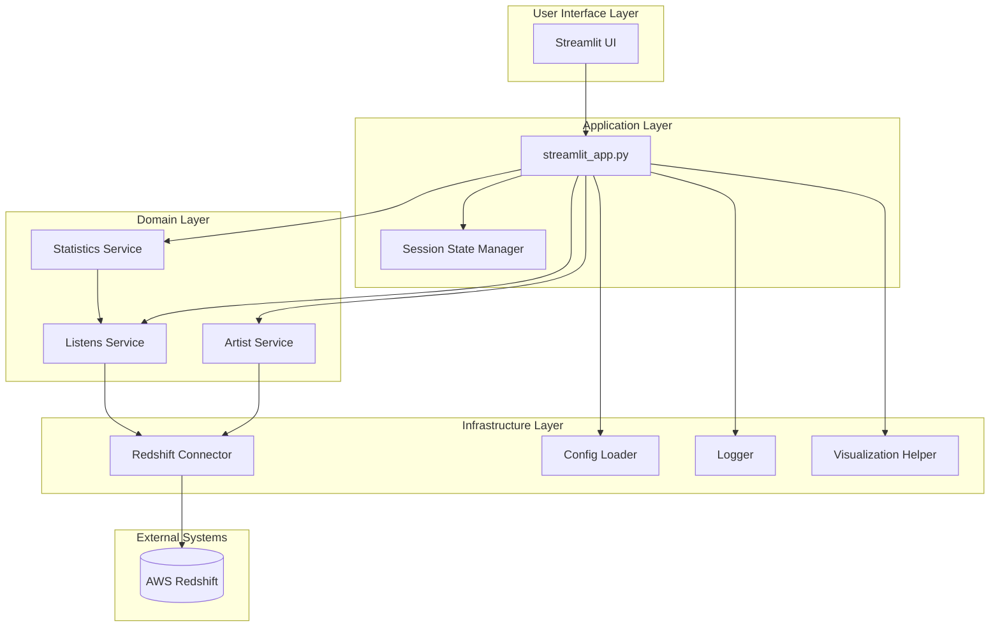
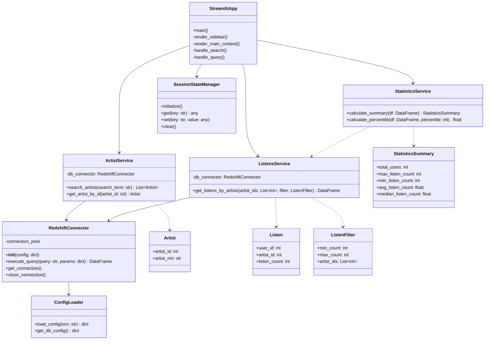
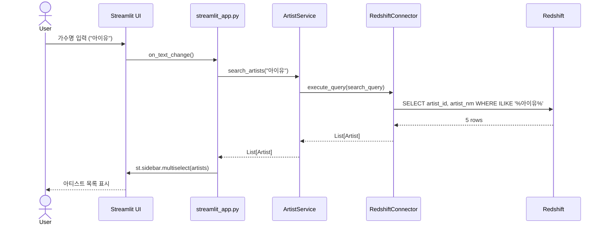
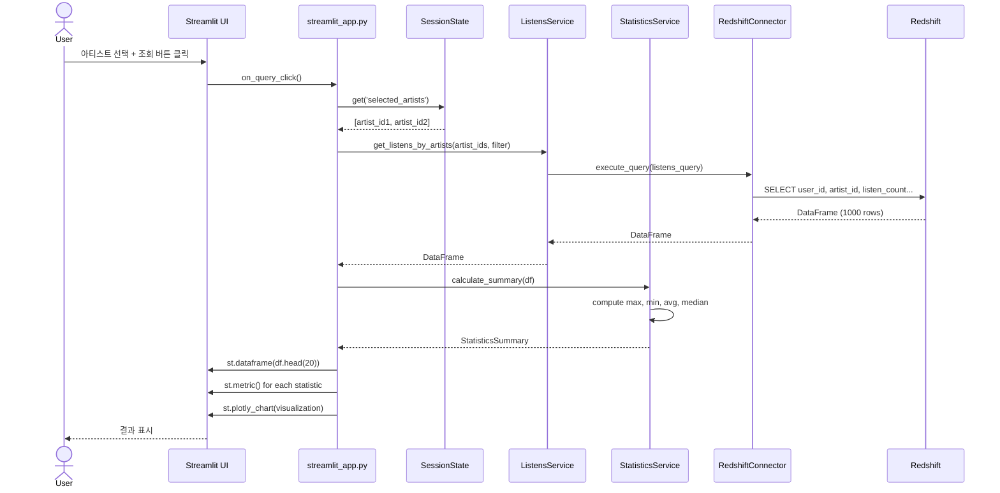
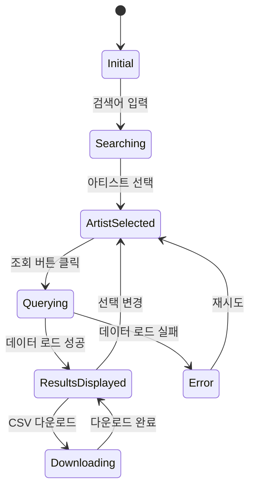

# design.md

Artist Character 데이터 조회 애플리케이션 설계 문서

참조: [requirements_detail.md](requirements_detail.md)

## 개요

본 문서는 Streamlit 기반 Artist Character 데이터 조회 애플리케이션의 설계를 정의한다. Clean Architecture와 SOLID 원칙을 준수하며, TDD 방식으로 개발한다.

## 아키텍처 설계

### 전체 시스템 아키텍처



### 레이어별 책임

#### 1. User Interface Layer
- **책임**: 사용자 인터랙션 처리 및 화면 렌더링
- **컴포넌트**: Streamlit UI 컴포넌트
- **주요 기능**:
  - 사이드바 (검색, 필터)
  - 메인 영역 (데이터 테이블, 통계, 시각화)
  - 다크/라이트 모드 전환

#### 2. Application Layer
- **책임**: 애플리케이션 흐름 제어 및 상태 관리
- **컴포넌트**: 
  - `streamlit_app.py`: 메인 애플리케이션
  - Session State Manager: 세션 상태 관리
- **주요 기능**:
  - 사용자 입력 수집 및 검증
  - 비즈니스 로직 호출
  - UI 렌더링 조정

#### 3. Domain Layer (Business Logic)
- **책임**: 핵심 비즈니스 로직 구현
- **컴포넌트**:
  - `Artist Service`: 아티스트 검색 및 관리
  - `Listens Service`: 청취 데이터 조회 및 필터링
  - `Statistics Service`: 통계 계산
- **주요 기능**:
  - 아티스트 검색 로직
  - 청취 데이터 필터링
  - 요약 통계 계산 (max, min, avg, median)

#### 4. Infrastructure Layer
- **책임**: 외부 시스템 연동 및 유틸리티
- **컴포넌트**:
  - `Redshift Connector`: DB 연결 및 쿼리 실행
  - `Config Loader`: 설정 파일 로드
  - `Logger`: 로깅
  - `Visualization Helper`: 시각화 헬퍼 함수
- **주요 기능**:
  - DB 커넥션 풀링
  - 쿼리 실행 및 결과 변환
  - 설정 관리
  - 차트 생성

## 상세 설계

### 1. 디렉토리 구조

```
artist-extract/
├── src/
│   ├── streamlit_app.py              # 메인 애플리케이션
│   ├── config/
│   │   └── __init__.py
│   ├── domain/
│   │   ├── __init__.py
│   │   ├── services/
│   │   │   ├── __init__.py
│   │   │   ├── artist_service.py     # 아티스트 검색 비즈니스 로직
│   │   │   ├── listens_service.py    # 청취 데이터 비즈니스 로직
│   │   │   └── statistics_service.py # 통계 계산 로직
│   │   └── models/
│   │       ├── __init__.py
│   │       ├── artist.py             # Artist 모델
│   │       └── listen.py             # Listen 모델
│   ├── infrastructure/
│   │   ├── __init__.py
│   │   ├── database/
│   │   │   ├── __init__.py
│   │   │   └── redshift_connector.py # Redshift 연결 및 쿼리
│   │   ├── config/
│   │   │   ├── __init__.py
│   │   │   └── config_loader.py      # 설정 파일 로더
│   │   └── logging/
│   │       ├── __init__.py
│   │       └── logger.py             # 로깅 설정
│   └── ui/
│       ├── __init__.py
│       ├── components/
│       │   ├── __init__.py
│       │   ├── sidebar.py            # 사이드바 컴포넌트
│       │   ├── data_table.py         # 데이터 테이블 컴포넌트
│       │   ├── statistics.py         # 통계 표시 컴포넌트
│       │   └── visualization.py      # 시각화 컴포넌트
│       └── utils/
│           ├── __init__.py
│           ├── session_state.py      # 세션 상태 관리
│           └── visualization_helper.py # 시각화 헬퍼
├── tests/
│   ├── __init__.py
│   ├── unit/
│   │   ├── test_artist_service.py
│   │   ├── test_listens_service.py
│   │   ├── test_statistics_service.py
│   │   └── test_redshift_connector.py
│   └── integration/
│       ├── test_end_to_end.py
│       └── test_database_integration.py
├── res/
│   └── config.artist-extract.dev.yml
├── .streamlit/
│   ├── config.toml
│   └── secrets.toml
├── logs/
│   └── process.log
└── requirements.txt
```

### 2. 클래스 다이어그램



### 3. 시퀀스 다이어그램

#### 3.1 아티스트 검색 플로우



#### 3.2 데이터 조회 및 통계 플로우



### 4. 데이터 모델

#### 4.1 Domain Models

```python
# domain/models/artist.py
@dataclass
class Artist:
    artist_id: int
    artist_nm: str
    
    def __str__(self) -> str:
        return f"{self.artist_nm} (ID: {self.artist_id})"
```

```python
# domain/models/listen.py
@dataclass
class Listen:
    user_id: int
    artist_id: int
    listen_count: int
    
@dataclass
class ListenFilter:
    artist_ids: List[int]
    min_count: Optional[int] = None
    max_count: Optional[int] = None
    
    def to_query_params(self) -> dict:
        return {
            'artist_ids': tuple(self.artist_ids),
            'min_count': self.min_count or 0,
            'max_count': self.max_count or 999999
        }
```

```python
# domain/models/statistics.py
@dataclass
class StatisticsSummary:
    total_users: int
    max_listen_count: int
    min_listen_count: int
    avg_listen_count: float
    median_listen_count: float
    
    def to_dict(self) -> dict:
        return asdict(self)
```

### 5. 데이터베이스 설계

#### 5.1 Redshift 스키마 정보

/// 아티스트 메타 테이블
flo_dwh.d_artist

/// 사용자-아티스트 청취 데이터
data_work.test_trk_artst_lstn_cnt_shen

#### 5.2 주요 쿼리

**아티스트 검색 쿼리**
```sql
SELECT 
    artist_id, 
    artist_nm 
FROM flo_dwh.d_artist 
WHERE artist_nm ILIKE %(search_term)s
LIMIT 5;
```

**청취 데이터 조회 쿼리**
```sql
SELECT 
    user_id, 
    artist_id, 
    listen_count 
FROM data_work.test_trk_artst_lstn_cnt_shen
WHERE artist_id IN %(artist_ids)s
  AND listen_count BETWEEN %(min_count)s AND %(max_count)s
ORDER BY listen_count DESC;
```

### 6. UI 컴포넌트 설계

#### 6.1 화면 레이아웃

```
┌─────────────────────────────────────────────────────────────┐
│                   Artist Character 데이터 조회                │
├──────────────┬──────────────────────────────────────────────┤
│              │  📊 조회 결과 (상위 20건)                     │
│  🎵 아티스트 │  ┌──────────────────────────────────────┐   │
│     검색     │  │ user_id │ artist_nm │ listen_count  │   │
│  ┌────────┐ │  ├──────────────────────────────────────┤   │
│  │ 검색어  │ │  │  123456 │  아이유   │    150       │   │
│  └────────┘ │  │  789012 │  아이유   │    145       │   │
│              │  │   ...   │   ...    │    ...       │   │
│  ☑ 아티스트1 │  └──────────────────────────────────────┘   │
│  ☑ 아티스트2 │  📥 CSV 다운로드                             │
│  ☐ 아티스트3 │  ─────────────────────────────────────────  │
│              │  📈 요약 통계                                │
│  🎚️ 청취건수  │  ┌────────┬────────┬────────┬────────────┐│
│  [0 ──── 99] │  │총 사용자│ 최대값  │ 최소값  │   평균    ││
│              │  │ 1,234  │  150   │   10   │   45.2    ││
│  [조회 버튼]  │  └────────┴────────┴────────┴────────────┘│
│              │  ─────────────────────────────────────────  │
│              │  📊 시각화                                  │
│              │  [청취건수 분포 히스토그램]                  │
│              │  [상위 사용자 바차트]                        │
└──────────────┴──────────────────────────────────────────────┘
```

#### 6.2 Streamlit 컴포넌트 매핑

| 영역 | 컴포넌트 | Streamlit API |
|------|---------|---------------|
| 타이틀 | 페이지 제목 | `st.title()` |
| 사이드바 - 검색 | 가수명 입력 | `st.sidebar.text_input()` |
| 사이드바 - 선택 | 아티스트 다중 선택 | `st.sidebar.multiselect()` |
| 사이드바 - 필터 | 청취건수 범위 | `st.sidebar.slider()` |
| 사이드바 - 버튼 | 조회 버튼 | `st.sidebar.button()` |
| 메인 - 데이터 | 결과 테이블 | `st.dataframe()` |
| 메인 - 다운로드 | CSV 다운로드 | `st.download_button()` |
| 메인 - 통계 | 요약 통계 카드 | `st.metric()` with `st.columns()` |
| 메인 - 시각화 | 차트 | `st.plotly_chart()` |

### 7. 상태 관리 설계

#### 7.1 Session State 구조

```python
# 세션 상태 초기화
if 'initialized' not in st.session_state:
    st.session_state.initialized = True
    st.session_state.search_term = ""
    st.session_state.artist_options = []
    st.session_state.selected_artists = []
    st.session_state.listen_count_range = (0, 100)
    st.session_state.query_results = None
    st.session_state.statistics = None
```

#### 7.2 상태 전이 다이어그램



### 8. 캐싱 전략

#### 8.1 캐싱 레이어

```python
# DB 커넥션 캐싱 (리소스 재사용)
@st.cache_resource
def get_db_connector():
    config = load_config()
    return RedshiftConnector(config)

# 아티스트 검색 결과 캐싱 (5분 TTL)
@st.cache_data(ttl=300)
def search_artists_cached(search_term: str) -> List[Artist]:
    service = ArtistService(get_db_connector())
    return service.search_artists(search_term)

# 청취 데이터는 캐싱하지 않음 (필터 조건 가변적)
def get_listens_data(artist_ids: List[int], filter: ListenFilter) -> pd.DataFrame:
    service = ListensService(get_db_connector())
    return service.get_listens_by_artists(artist_ids, filter)
```

### 9. 에러 처리 전략

#### 9.1 에러 핸들링 계층

```python
# Application Layer - 사용자 친화적 메시지
try:
    results = get_listens_data(artist_ids, filter)
    if results.empty:
        st.info("조회 결과가 없습니다. 필터 조건을 변경해보세요.")
except DatabaseConnectionError as e:
    st.error("데이터베이스 연결에 실패했습니다. 잠시 후 다시 시도해주세요.")
    logger.error(f"DB Connection Error: {e}")
except QueryExecutionError as e:
    st.error("데이터 조회 중 오류가 발생했습니다.")
    logger.error(f"Query Execution Error: {e}")
except Exception as e:
    st.error("예기치 않은 오류가 발생했습니다. 관리자에게 문의하세요.")
    logger.error(f"Unexpected Error: {e}", exc_info=True)
```

#### 9.2 커스텀 예외 클래스

```python
class ArtistExtractException(Exception):
    """Base exception for artist extract application"""
    pass

class DatabaseConnectionError(ArtistExtractException):
    """Database connection failed"""
    pass

class QueryExecutionError(ArtistExtractException):
    """Query execution failed"""
    pass

class ConfigurationError(ArtistExtractException):
    """Configuration loading failed"""
    pass
```

### 10. 로깅 설계

#### 10.1 로그 레벨 전략

| 레벨 | 용도 | 예시 |
|------|------|------|
| DEBUG | 개발 디버깅 | 쿼리 파라미터, 중간 데이터 |
| INFO | 주요 작업 진행 | 검색 실행, 데이터 조회 완료 |
| WARNING | 예상 가능한 문제 | 빈 결과, 잘못된 입력 |
| ERROR | 복구 가능한 에러 | DB 연결 실패, 쿼리 에러 |
| CRITICAL | 복구 불가능한 에러 | 설정 파일 누락 |

#### 10.2 로그 포맷

```
[2025-12-31 14:30:45,123] [INFO] [artist_service] - Searching artists with term: '아이유'
[2025-12-31 14:30:45,456] [DEBUG] [redshift_connector] - Executing query: SELECT artist_id...
[2025-12-31 14:30:45,789] [INFO] [artist_service] - Found 5 artists
[2025-12-31 14:30:50,123] [INFO] [listens_service] - Fetching listens for 2 artists
[2025-12-31 14:30:52,456] [INFO] [listens_service] - Fetched 1234 records
[2025-12-31 14:30:52,789] [INFO] [statistics_service] - Calculated statistics: max=150, avg=45.2
```

### 11. 성능 최적화

#### 11.1 쿼리 최적화
- Redshift에서 필터링 수행 (애플리케이션 레벨 최소화)
- `LIMIT` 활용으로 불필요한 데이터 전송 방지
- 인덱스 활용 (artist_id, listen_count)

#### 11.2 데이터 전송 최적화
- 화면 표시는 상위 20건, CSV 다운로드는 전체
- Pandas DataFrame 사용으로 메모리 효율적 처리
- 대용량 데이터는 청크 단위로 처리 (향후 고려)

#### 11.3 UI 렌더링 최적화
- `st.cache_data`로 반복 쿼리 방지
- `st.spinner()`로 로딩 중 사용자 피드백
- 데이터 변경 시에만 재렌더링

### 12. 보안 설계

#### 12.1 민감 정보 관리
- `.streamlit/secrets.toml`에 DB 인증 정보 저장
- Git에서 제외 (`.gitignore` 설정)
- 환경별 설정 분리 (dev, prod)

#### 12.2 SQL Injection 방지
- Parameterized Query 사용
- ORM 또는 쿼리 빌더 활용
- 사용자 입력 검증 및 이스케이핑

```python
# ❌ Bad: SQL Injection 취약
query = f"SELECT * FROM artists WHERE name = '{user_input}'"

# ✅ Good: Parameterized Query
query = "SELECT * FROM artists WHERE name = %(name)s"
params = {'name': user_input}
```

#### 12.3 접근 제어
- 현재는 로컬 실행으로 불필요
- 향후 Streamlit Cloud 배포 시 인증 추가 고려

### 13. 테스트 전략

#### 13.1 테스트 피라미드

```
        ┌─────────────┐
        │   E2E (5%)  │  ← Selenium/Streamlit Testing
        ├─────────────┤
        │Integration  │  ← DB Integration Tests
        │   (15%)     │
        ├─────────────┤
        │    Unit     │  ← Service, Model Tests
        │   (80%)     │
        └─────────────┘
```

#### 13.2 테스트 커버리지 목표
- 전체 코드 커버리지: 80% 이상
- Domain Layer: 90% 이상
- Infrastructure Layer: 70% 이상
- UI Layer: 수동 테스트

#### 13.3 테스트 케이스

**ArtistService 테스트**
- 검색어 없을 때 빈 리스트 반환
- 정상 검색 시 최대 5개 반환
- 특수문자 포함 검색어 처리
- DB 연결 실패 시 예외 발생

**ListensService 테스트**
- 필터 없이 조회 시 전체 데이터 반환
- 청취건수 범위 필터 정상 동작
- 여러 아티스트 동시 조회
- 빈 결과 처리

**StatisticsService 테스트**
- 정확한 통계값 계산 (max, min, avg, median)
- 빈 데이터프레임 처리
- 극단값 처리 (0, 매우 큰 수)

### 14. 배포 전략

#### 14.1 로컬 실행
```bash
# 환경 설정
cp .streamlit/secrets.toml.example .streamlit/secrets.toml
vim .streamlit/secrets.toml  # DB 정보 입력

# 의존성 설치
pip install -r requirements.txt

# 실행
streamlit run src/streamlit_app.py
```

#### 14.2 Streamlit Cloud 배포 (선택사항)
- GitHub 리포지토리 연동
- Secrets 설정 (UI에서 입력)
- 자동 배포 활성화

### 15. 모니터링 및 관찰성

#### 15.1 로그 모니터링
- `logs/process.log` 파일 확인
- 주요 이벤트 추적 (검색, 조회, 에러)
- 로그 로테이션 설정 (일별 또는 크기별)

#### 15.2 성능 메트릭
- 쿼리 실행 시간 기록
- 사용자 세션 수 (Streamlit Cloud)
- 에러 발생 빈도

## 구현 우선순위

### Phase 1: MVP (Minimum Viable Product)
1. ✅ 기본 프로젝트 구조 생성
2. ✅ Redshift 연결 구현
3. ✅ 아티스트 검색 기능
4. ✅ 청취 데이터 조회 기능
5. ✅ 기본 UI 구현 (사이드바 + 테이블)

### Phase 2: 핵심 기능 완성
1. ✅ 청취건수 필터 구현
2. ✅ 통계 계산 및 표시
3. ✅ CSV 다운로드 기능
4. ✅ 에러 처리 및 로깅
5. ✅ 단위 테스트 작성

### Phase 3: UX 개선
1. ✅ 시각화 추가 (차트)
2. ✅ 다크/라이트 모드 설정
3. ✅ 로딩 인디케이터 추가
4. ✅ 빈 상태 처리 개선

### Phase 4: 안정화
1. ✅ 통합 테스트
2. ✅ 성능 최적화
3. ✅ 문서화 완성
4. ✅ 배포 준비

## 향후 개선사항 (Nice-to-Have)

1. **페이지네이션**: 대용량 데이터 처리
2. **고급 필터**: 날짜 범위, 성별, 연령대 등
3. **즐겨찾기**: 자주 조회하는 아티스트 저장
4. **대시보드**: 실시간 통계 모니터링
5. **엑셀 내보내기**: CSV 외 다양한 포맷 지원
6. **다국어 지원**: 영어, 한국어 전환

## 참고 자료

- [Streamlit Documentation](https://docs.streamlit.io/)
- [AWS Redshift Best Practices](https://docs.aws.amazon.com/redshift/latest/dg/best-practices.html)
- [Clean Architecture in Python](https://github.com/cosmic-python/book)
- [Pandas Documentation](https://pandas.pydata.org/docs/)
